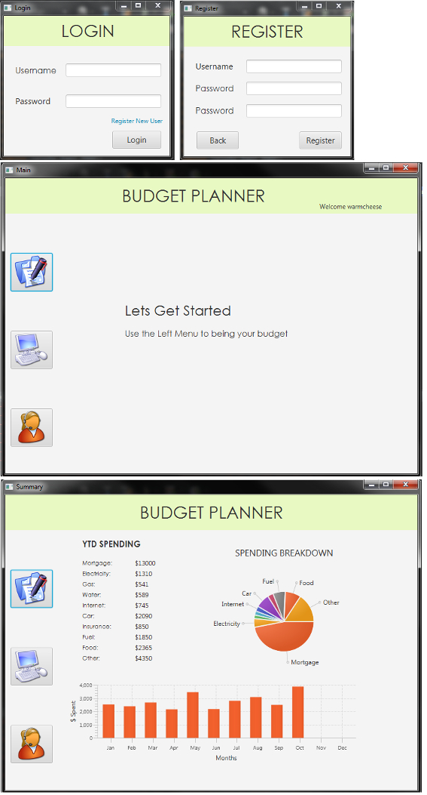

<h2>Budget Planner in Java</h2>

database passwords removed

<ul>
  <li>Console application built in Java using MVC</li>
  <li>GUI created using JavaFX</li>
  <li>Allows user to register and login</li>
  <li>Stores hashed password and salt</li>
  <li>Stores budget information in relational database using MySQL</li>
  <li>Displays financial information in graphs and charts for user</li>
</ul>

